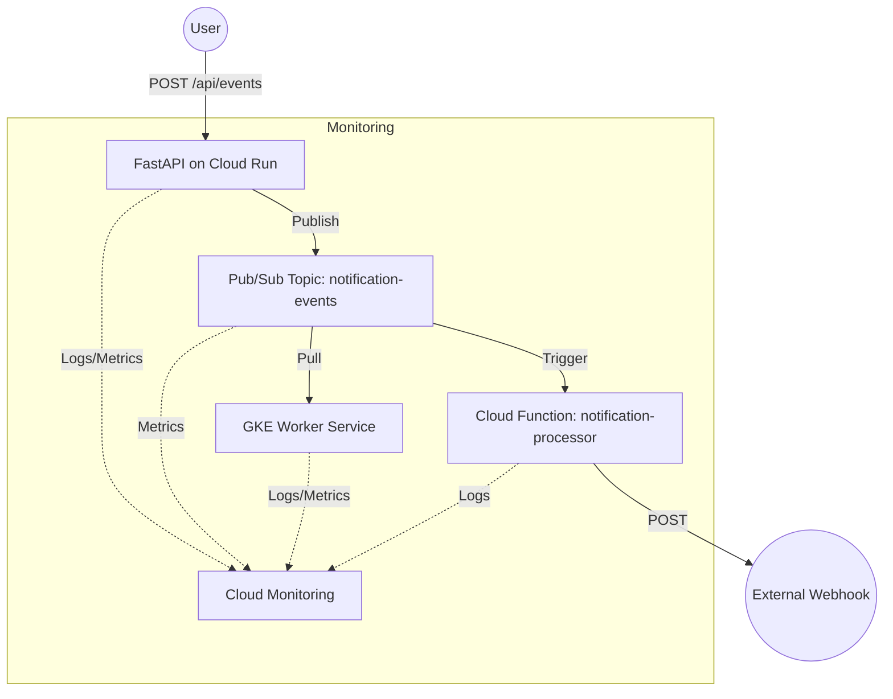

# NovaPulse: Real-Time Notification System

A highly scalable, event-driven notification architecture built on Google Cloud Platform. NovaPulse enables real-time event processing using FastAPI, Pub/Sub, Cloud Functions, and Google Kubernetes Engine (GKE).

## Architecture



## Tech Stack

| Category | Technology |
|----------|------------|
| **Backend** | Python 3.11, FastAPI, Pydantic |
| **Messaging** | Google Cloud Pub/Sub |
| **Compute** | Google Cloud Run, GKE Autopilot, Cloud Functions |
| **Infrastructure** | Terraform, Docker |
| **CI/CD** | GitHub Actions |
| **Monitoring** | Google Cloud Monitoring, Cloud Logging |

## Project Structure

```text
NovaPulse/
├── .github/workflows/    # CI/CD pipelines
├── backend/              # FastAPI application
├── frontend/             # React dashboard
├── cloud-functions/      # Serverless processors
├── worker-service/       # GKE-based background workers
├── terraform/            # Infrastructure as Code
├── monitoring/           # Dashboard definitions
└── README.md             # Project documentation
```

## Setup Guide

### 1. Prerequisites
- [Google Cloud SDK](https://cloud.google.com/sdk/docs/install)
- [Terraform](https://developer.hashicorp.com/terraform/downloads)
- [Docker](https://docs.docker.com/get-docker/)
- [kubectl](https://kubernetes.io/docs/tasks/tools/)

### 2. Google Cloud Setup
1. Create a new GCP Project.
2. Enable Billing.
3. Authenticate the CLI: `gcloud auth application-default login`.

### 3. Infrastructure Provisioning
1. Navigate to the `terraform/` directory.
2. Initialize and apply:
   ```bash
   terraform init
   terraform apply -var="project_id=YOUR_PROJECT_ID" -var="alert_email=YOUR_EMAIL"
   ```

### 4. GitHub Actions Configuration
Add the following secrets to your repository (`Settings > Secrets and variables > Actions`):
- `GCP_PROJECT_ID`: Your GCP project ID.
- `GCP_SA_KEY`: JSON service account key with Owner permissions (for initial setup).
- `GCP_REGION`: Target deployment region (e.g., `us-central1`).

### 5. Deployment
Push any changes to the `main` branch to trigger the automated deployment pipelines:
```bash
git add .
git commit -m "feat: initial system deployment"
git push origin main
```

## API Documentation

### POST `/api/events`
Submit a new event for real-time processing.

**Request Body:**
```json
{
  "event_type": "order_placed",
  "user_id": "user_123",
  "payload": {
    "order_id": "ABC-789",
    "amount": 49.99
  }
}
```

**Success Response (201 Created):**
```json
{
  "status": "success",
  "message": "Event processed successfully",
  "event_id": "550e8400-e29b-41d4-a716-446655440000"
}
```

**Error Response (400 Bad Request):**
```json
{
  "detail": "Missing required field: user_id"
}
```

## Monitoring and Alerting

### Setup
1. Define `alert_email` in `terraform/terraform.tfvars`.
2. Apply terraform:
   ```bash
   terraform apply
   ```

### Dashboard
Import `monitoring/dashboard.json` into the Google Cloud Monitoring console to visualize system health.

## Frontend Dashboard

### Setup
1. Navigate to `frontend/`.
2. Install dependencies: `npm install`.
3. Configure `VITE_API_URL` in `.env`.
4. Run locally: `npm run dev`.

### Docker
```bash
docker build -t novapulse-frontend .
docker run -p 80:80 novapulse-frontend
```

## Contributing
1. Fork the project.
2. Create your feature branch (`git checkout -b feature/AmazingFeature`).
3. Commit your changes (`git commit -m 'Add some AmazingFeature'`).
4. Push to the branch (`git push origin feature/AmazingFeature`).
5. Open a Pull Request.

## License
Distributed under the MIT License. See `LICENSE` for more information.
